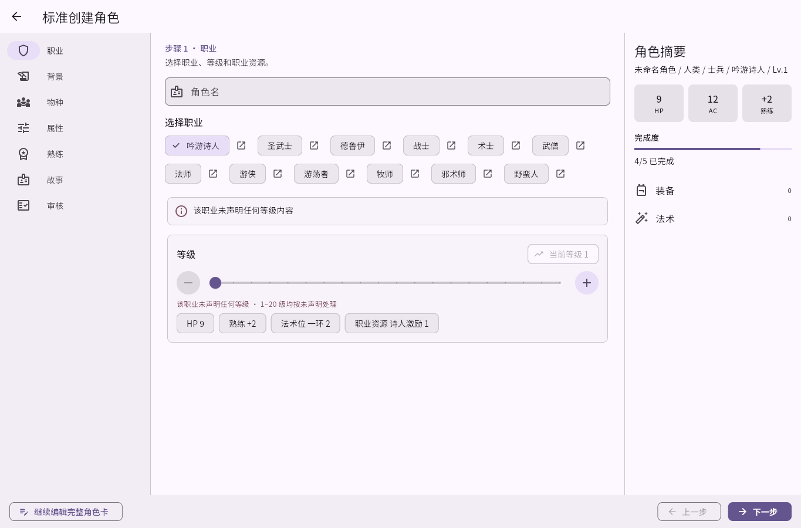
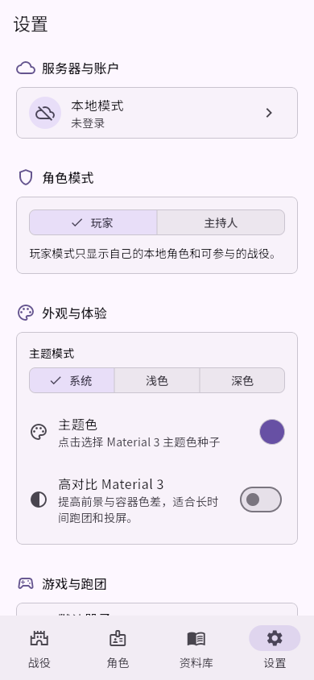
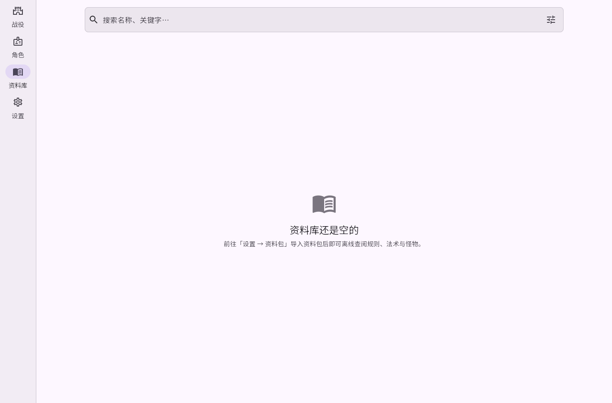

<p align="center"></p>

# OhMyDungeon

一个离线优先的 D&D 2024 跑团助手。用 Flutter 管理角色卡、规则资料与掷骰；需要和朋友开团时，连接自托管服务器进入持续存在的战役聊天室。

**角色和导入的资料留在本机；战役聊天、成员协作与可选的 Vault 同步才需要服务器。**

[下载 0.1 预览版](https://github.com/ZZZzcxZZZ/oh-my-dungeon/releases/tag/v0.1.0-preview.1) · [部署自己的服务器](#31-部署服务器) · [技术与数据契约](docs/README.md)

> 这是测试版本，不含战斗系统或 AI Agent 运行时。公开安装包**不内置商业规则书正文**：完整的职业、法术等资料需要用户自行导入合法取得的内容包。

## 界面预览

以下截图来自**未导入私有资料**的公开 Web 构建。

| 桌面：角色创建向导 | 手机：Material 3 设置 |
|---|---|
|  |  |

创建向导可先填写角色和数值；完整的等级特性与可选内容由导入的资料包提供。资料库公开版默认空白，导入后即可离线检索：



**目前能做什么**：离线创建与编辑角色、导入和检索内容包、Markdown 角色卡导入导出、组合掷骰；连上服务器后可创建战役、聊天、共享档案与角色，并使用 DM 快捷操作。

设计规范见 [`DESIGN.md`](DESIGN.md)，当前实现与限制见 [`docs/README.md`](docs/README.md)。

---

## 目录

- [1. 五分钟上手](#1-五分钟上手)
- [2. 使用教程](#2-使用教程)
  - [2.1 角色](#21-角色)
  - [2.2 资料库](#22-资料库)
  - [2.3 掷骰与检定](#23-掷骰与检定)
  - [2.4 设置与个性化](#24-设置与个性化)
- [3. 和朋友一起跑：自托管服务器](#3-和朋友一起跑自托管服务器)
  - [3.1 部署服务器](#31-部署服务器)
  - [3.2 客户端连接](#32-客户端连接)
  - [3.3 创建与加入战役](#33-创建与加入战役)
  - [3.4 战役内能做什么](#34-战役内能做什么)
  - [3.5 连不上？先看这里](#35-连不上先看这里)
- [4. 备份与恢复](#4-备份与恢复)
- [5. 常见问题](#5-常见问题)
- [6. 自己构建安装包](#6-自己构建安装包)
- [7. 开发者](#7-开发者)
- [8. 私有资料与合规](#8-私有资料与合规)

---

## 1. 五分钟上手

**第 1 步：装客户端**

| 平台 | 做法 |
|---|---|
| Android | 从 [预览版 Release](https://github.com/ZZZzcxZZZ/oh-my-dungeon/releases/tag/v0.1.0-preview.1) 下载公开 APK，或自行构建（见 [6. 自己构建安装包](#6-自己构建安装包)） |
| Windows / Linux / macOS | `cd apps/client_flutter && flutter run -d windows`（或 `linux` / `macos`） |
| 浏览器 | `npm run preview:client`（本地 Web 预览，含后端代理） |

**第 2 步：打开后做三件事**

1. **建角色** —— 底部/侧边选「角色」→ 右下角 **+** → 按向导创建；也可以快速建 NPC 或选怪物模板。
2. **导入资料包**（可选）—— 「设置 → 资料与存储 → 资料包」→ 导入内容包 JSON；导入后「资料库」可搜索法术、怪物、物品。
3. **掷骰** —— 在角色卡「动作」页直接掷，或在战役聊天里点工具入口「掷骰」。

不需要服务器，以上全部可用。

---

## 2. 使用教程

### 2.1 角色

**创建角色**

- 「角色」→ **+**：标准创建向导（按规则包逐步选种族/职业/背景/属性/法术/装备）
- DM 额外可快速创建 NPC、或从怪物模板创建
- 也可以导入已有的 Markdown 角色卡

**角色卡**

打开角色卡后按页签浏览：

| 页签 | 内容 |
|---|---|
| 属性 | 六维、豁免、技能、被动感知 |
| 动作 | 武器攻击、自定义动作、资源消耗 |
| 法术 | 法术位、准备/已知法术、施法加值 |
| 怪物资料 | 仅怪物模板：动作、特性、图鉴条目 |

可做的事：编辑、升级（按等级流程）、调整生命值/资源/状态、管理装备与货币、记录笔记。

**同步与离线**：角色默认存在本地，离线完全可用。连服务器后可以把角色**发布到战役**并与
战役角色绑定；外部 Markdown 文件被修改时，应用会提示差异并让你确认。

### 2.2 资料库

- 「资料库」按分类浏览，或直接搜索名称/关键字，支持类型、来源、标签等筛选与收藏。
- 条目详情包含结构化字段、正文区块（标题/列表/表格/引用/提示框/骰式/图片）与关联条目跳转。
- 资料包管理在「设置 → 资料与存储 → 资料包」：导入、启用/停用、删除、批量导入。
- 自制内容（本地 homebrew）与导入包共用同一套分类与校验规则。

> 公开构建**不含**任何商业规则正文，资料库初始为空，需自行导入内容包（见
> [8. 私有资料与合规](#8-私有资料与合规)）。

### 2.3 掷骰与检定

- 「设置 → 游戏与跑团」可设默认骰子、是否掷骰前确认、快捷骰预设、骰式消息密度。
- 战役聊天里的工具入口：

  | 工具 | 用途 |
  |---|---|
  | 掷骰 | 组合骰（数量/面数/修正、优劣势） |
  | 代掷检定 | DM 向玩家发起检定请求（属性/技能、DC） |
  | 生命值 | 批量扣血/治疗 |
  | 给予物品 / 给予状态 | 发放物品与状态 |
  | 角色动作 | 触发角色卡上的动作 |
  | 资料库 | 在聊天中检索并分享条目 |
  | 记录线索 / 分享地点 | 战役档案快速记录 |

### 2.4 设置与个性化

| 分区 | 能做什么 |
|---|---|
| 角色模式 | 在「玩家 / 主持人（DM）」之间切换 |
| 外观与体验 | 主题色（Material 3 动态色）、深浅色、高对比模式 |
| 服务器与账户 | 添加服务器、登录/注册、自动登录、Vault 同步 |
| 游戏与跑团 | 默认骰子、掷骰确认、消息密度、字体缩放、默认角色卡标签 |
| 资料与存储 | 资料包管理、数据管理（备份导出/恢复） |
| 关于 | 版本与数据归属说明 |

---

## 3. 和朋友一起跑：自托管服务器

服务器负责：账号、可选 Personal Vault 同步、以及**战役协作**（聊天/档案/角色共享）。
客户端离线优先，服务器不可用时本地功能不受影响。

### 3.1 部署服务器

需要一台装了 Docker Engine + Compose v2 的 Linux 主机。优先下载
[预览版 Linux 部署包](https://github.com/ZZZzcxZZZ/oh-my-dungeon/releases/tag/v0.1.0-preview.1)，
包内带预构建镜像，低内存主机无需现场编译。

```bash
# 上传下载的部署包到服务器后：
tar xzf ohmydungeon-server-linux-0.1.0-preview.1.tar.gz
cd ohmydungeon-server-linux-0.1.0-preview.1
chmod +x start.sh stop.sh
./start.sh
```

`start.sh` 会自动：生成 `.env` 与随机密钥 → 探测公网地址写入 `PUBLIC_BASE_URL` →
加载预构建镜像 → 执行 Prisma 迁移与 seed → 等待 `/health` 通过。
源码自行打包仍可运行 `scripts/build-linux-server-package.ps1`，不附带镜像时会在服务器上构建。

常用运维命令（在部署目录内）：

```bash
docker compose ps                 # 容器状态
docker compose logs -f server     # 服务端日志
./stop.sh                         # 停止（数据卷保留）
```

升级前请备份数据库和 `.env`；不要使用 `docker compose down -v`，它会删除数据卷。

### 3.2 客户端连接

1. 确保服务器地址可达：浏览器打开 `http://<服务器IP>:3000/health` 应返回 `{"status":"ok",...}`。
2. 客户端「设置 → 服务器与账户 → 管理服务器 → 添加服务器」填写地址
   `http://<服务器IP>:3000`，点「测试并保存」。
3. 在「服务器与账户」里注册或登录。之后该服务器成为默认服务器，重启自动恢复会话。

> 客户端通过 `/.well-known/dnd-tool-server` 自动获取 API 与 WebSocket 地址，填根地址即可。

### 3.3 创建与加入战役

- **创建**：战役页 → 「创建战役」→ 生成**邀请码**；DM 可管理成员、档案、角色。
- **加入**：战役页 → 「使用邀请码加入战役」→ 输入邀请码。
- 战役是长期工作区，包含：主聊、私聊、小群、角色、成员、档案、共享资料。

### 3.4 战役内能做什么

- **概览 / 角色 / 档案** 三个页签 + 聊天面板
- 主聊与人私聊、创建小群；未读提醒与增量刷新
- 玩家把本地角色**发布**到战役并绑定；DM 可管理全部战役角色、设置发言身份
- 档案：条目（资料/地点/线索/文件）、标签筛选、关联条目、Markdown 正文
- 聊天工具见 [2.3 掷骰与检定](#23-掷骰与检定)

### 3.5 连不上？先看这里

| 症状 | 排查 |
|---|---|
| 浏览器打不开 `/health` | ① 服务器本机 `curl 127.0.0.1:3000/health`；② **服务器防火墙**（如 `sudo ufw allow 3000/tcp`）；③ **云厂商安全组放行 TCP 3000**（实例自身访问公网 IP 也受安全组约束） |
| 服务端日志正常但客户端连不上 | 检查 `PUBLIC_BASE_URL` 是否为客户端可达地址（公网 IP 或反代域名），改完重跑 `./start.sh` |
| 部署镜像构建失败在 `npm ci` | 服务器访问不了 npm 官方源，给 Dockerfile 的 `npm ci` 加镜像参数（如 `--registry=https://registry.npmmirror.com --replace-registry-host=always`） |
| 镜像构建失败于 `prisma generate` | 部署包缺少 `apps/server_nest/engines/`（离线引擎），重新打包（打包脚本会提前报错） |

---

## 4. 备份与恢复

- 「设置 → 资料与存储 → 数据管理 → 导出备份」生成 `.ohmydungeon-backup` 文件（含角色与资料）。
- 恢复：同一入口选择备份文件，确认后覆盖当前工作区数据。
- 兼容旧扩展名 `.openquest-backup`、`.dndtable-backup`。
- 备份是**本地文件**，请自行妥善保存；Vault 同步不等于备份。

---

## 5. 常见问题

| 问题 | 说明 |
|---|---|
| 资料库是空的？ | 公开构建不含规则正文，需要自己导入内容包（设置 → 资料包） |
| 需要联网吗？ | 不需要。角色、资料库、设置、Markdown 镜像全部离线可用 |
| 能和朋友一起用吗？ | 需要一台自托管服务器（见第 3 节），或加入别人已部署的服务器 |
| 服务器数据存在哪？ | Docker 数据卷（PostgreSQL + 上传文件）；`docker compose down -v` 会清空 |
| 支持哪些规则？ | 当前为 D&D 2024（系统标识 `dnd5e-2024`）；内容包格式见文档索引中的内容包规范 |
| 手机浏览器能用吗？ | 可以，Web 构建支持移动视口 |

---

## 6. 自己构建安装包

```bash
cd apps/client_flutter
flutter pub get
flutter build apk --release        # Android
flutter build web --release        # Web
flutter build windows --release    # Windows
```

**内嵌自有资料 / 内嵌默认服务器**（本地自用，脚本会在构建后恢复公开占位文件）：

```powershell
pwsh -File scripts/build_private_client.ps1 -Target apk -BuildArgs @(
  '--release',
  '--dart-define=BUNDLED_DEFAULT_SERVER=true',
  '--dart-define=DEFAULT_SERVER_BASE_URL=http://<服务器IP>:3000'
)
```

- `-Target` 支持 `apk` / `web` / `windows` / `linux` / `macos`
- 内嵌默认服务器只在发布构建启用：首次启动自动加入并设为默认（测试与公开构建不受影响）

---

## 7. 开发者

**环境**：Node.js 22、Flutter stable、Docker（本地数据库/部署）、Python 3（可选，私有资料工具）

```powershell
npm run bootstrap     # 安装服务端依赖 + flutter pub get
npm run check         # 阶段门：服务端 lint/测试 + 客户端 analyze/测试
npm run dev:client    # 跑客户端
npm run dev:server    # 跑服务端（配合 npm run docker:up）
```

| 命令 | 作用 |
|---|---|
| `npm run test` / `test:server` / `test:client` | 测试 |
| `npm run lint:server` / `analyze:client` | 静态检查 |
| `npm run lint:design` | 校验 `DESIGN.md`（官方 design.md lint） |
| `npm run test:scripts` | Python 脚本层单测（打包/预览/提取器） |
| `npm run docker:up` / `docker:down` / `docker:logs` | 本地 PostgreSQL |
| `npm run preview:client` | 本地 Web 预览（含后端代理） |

**目录**

```text
apps/client_flutter/   Flutter 客户端（离线优先）
apps/server_nest/      NestJS 服务端（REST + Socket.IO，Prisma/PostgreSQL）
infra/linux-server/    自托管脚本（start.sh / stop.sh）
scripts/               环境、验证、打包与私有资料工具
docs/                  单一文档（docs/README.md）+ 历史档案（docs/archive/）
DESIGN.md              设计系统 token 与规范
docker-compose.yml     生产编排
```

**约定**：客户端与服务端只通过查询/操作服务访问数据，不直写数据库；UI 组件与主题必须走
`DESIGN.md` 契约（颜色角色、8/16dp 圆角、4/8px 间距、扁平高度），契约测试见
`apps/client_flutter/test/app_theme_test.dart`。

**离线 Prisma 引擎**：服务端部署包需要 `apps/server_nest/engines/`（被 Git 忽略）：

```powershell
cd apps/server_nest
npm ci
npx prisma generate
Copy-Item node_modules\@prisma\engines\schema-engine-linux-musl-openssl-3.0.x engines\
Copy-Item node_modules\@prisma\engines\libquery_engine-linux-musl-openssl-3.0.x.so.node engines\
```

---

## 8. 私有资料与合规

公开仓库、公开构建与公开分发**不包含**任何商业规则正文。私有测试资料放在被 `.gitignore`
排除的 `private-imports/`，仅供本地自用；分享任何构建产物前，请确认其中不含规则正文。

---

## 文档

- **[docs/README.md](docs/README.md)** —— 项目唯一事实来源（架构、领域模型、数据与同步、
  接口边界、内容包格式、部署运维、工程规范、设计系统约束、当前状态）
- [`DESIGN.md`](DESIGN.md) —— 设计系统 token 与组件契约
- `docs/archive/` —— 历史档案，仅用于追溯
