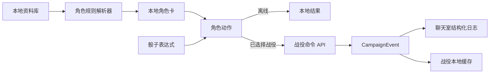

# v0.1 产品整合与体验收敛路线图

> 本文件是 v0.1 后续开发的唯一总路线图。`docs/superpowers/specs` 保存设计依据，`docs/superpowers/plans` 保存可执行步骤；若局部计划与本文件顺序冲突，以本文件为准。

## 目标

把当前分散的资料查阅、角色规则、战役聊天和 DM 操作收敛为三个清晰产品域：

1. **离线规则域**：资料库、角色创建、升级和角色卡不依赖服务器。
2. **在线战役域**：聊天室、私聊/小群、战役档案和结构化事件经服务器同步。
3. **应用外壳域**：只保留战役、角色、资料库、设置四个一级入口，减少重复页面。

资料库是规则事实来源，角色卡消费规则，战役只保存角色快照和发生过的事件。客户端不得为了发送一次检定而把离线角色功能整体绑定到网络。

## 产品原则

- 高频操作一到两次点击完成，低频管理进入二级界面。
- 同一个对象只有一套详情展示：资料条目统一浮层阅读器，角色统一完整角色卡。
- 所有影响战役状态的动作都产生结构化日志，而不是只显示一次 Snackbar。
- UI 使用 Material 3 原生语义：`NavigationBar`、`NavigationRail`、`SearchBar`、`FilterChip`、`SegmentedButton`、`BottomSheet`、`Dialog`。
- 临时发言身份是消息快照，用后即弃；常驻 NPC 才是可管理的战役角色。
- 不扩展与当前目标无关的自动化、主题特效或复杂权限选项。

## 现有计划合并关系

| 已有计划 | 当前状态 | 纳入阶段 |
| --- | --- | --- |
| [战役聊天壳层重构](../superpowers/plans/2026-07-22-campaign-chat-shell-ui-refactor.md) | 已完成基础拆分；继续修正视觉回归 | P0 |
| [高频界面减负](../superpowers/plans/2026-07-23-high-frequency-ui-simplification.md) | 首页、模式按钮、归档折叠、生命环刷新已实现 | P0 |
| [设置可靠性与 Material 3](../superpowers/plans/2026-07-22-settings-reliability-material3.md) | 待执行 | P1 |
| [全局 Material 3 设计系统](../superpowers/plans/2026-07-22-global-material3-design-system.md) | 待执行；与设置主题基础合并启动 | P1，并贯穿 P2-P7 |
| [角色呈现壳层重构](../superpowers/plans/2026-07-22-character-presentation-shell-refactor.md) | 壳层基础已完成 | P3 基线 |
| [角色内容密度优化](../superpowers/plans/2026-07-22-character-content-density.md) | 待执行 | P3 |
| [战役主聊、私聊和小群](../superpowers/plans/2026-07-22-campaign-conversations.md) | 待执行 | P7 |

没有单独列入上表的资料库、骰子事件、角色战役联动和战役档案，需要在对应阶段开始前从本路线图生成独立执行计划。不得直接把整个路线图当作一次大改提交。

## 统一数据流

`CampaignEvent` 最小类型集合：

- `message.say`、`message.act`、`message.narration`
- `roll.dice`、`roll.check`、`roll.save`、`roll.initiative`
- `actor.hp_changed`、`actor.item_granted`
- `archive.published`、`system.notice`

HP 与给予物品必须由服务端在同一事务中完成状态修改和事件追加，避免角色状态已经改变但聊天室没有记录。

## 开发顺序

### P0 高频界面减负（进行中）

1. 删除无有效任务的首页，默认进入战役。
2. “说/做”保留两个清晰语义分区（参考 Material 3 `SegmentedButton`），加入 thumb 滑动动画（`AnimatedAlign` + 240ms `Curves.easeInOutCubic`）；不再只显示 icon，加文字标签「说」「做」。
3. 战役角色栏的归档区默认折叠。
4. 修复战役中心各区块间距和视觉层级。
5. 生命环使用“中性完整轨道 + 剩余 HP 圆弧”；历史消息固定使用发送时健康快照，输入栏与身份切换使用角色当前 HP；只有公开健康分级时显示代表性弧度。
6. 聊天 Composer 收敛为头像、统一输入表面、发送键三段；说/做按钮嵌入输入表面，不再与输入框并排形成四个独立色块。
7. 连续消息默认合并头像，但用户可在设置中关闭，且选择跨启动保留。

完成标准：手机与桌面只显示四个一级入口；高频聊天区域不增加高度；归档角色不再挤占主列表；HP 变化产生可见圆弧变化；360px 下输入文字区域不少于 120px。

### P1 设置可靠性与全局 Material 3 基础

1. 删除不能产生真实行为的设置项（如「默认创建方式」，编辑器已内置选择页）。
2. 按“外观与体验、资料与存储、服务器与账户、角色模式、关于”重排。
3. 所有设置由同一个持久化仓储保存；客户端 DM/Player 模式也必须持久化。
4. 建立统一 `AppTheme`：seed color 只生成 tonal palette，不直接作为页面背景。
5. 提供预设色和自定义取色，统一 AppBar、导航、Tab、输入框、列表、对话框、BottomSheet、Chip 和按钮主题。
6. 后续功能页只消费全局 token；确有领域语义时才增加局部样式。
7. **新增**：统一所有“新建”类入口为 `FloatingActionButton.extended` + 语义化 icon（角色与档案入口风格一致）。
8. **新增**：增加自定义项（默认掷骰模式、快捷骰预设、消息密度、字体缩放、HP 警告阈值）。

完成标准：重启后设置值不丢失；账户和服务器入口不再散落；相同控件在不同页面拥有一致尺寸、圆角和状态；任意 seed color 的亮暗主题保持可读；新建按钮在所有页面风格一致。

### P2 资料库成为只读查阅平台

1. 从资料详情移除编辑、复制和笔记入口；导入与资料包管理只放在设置。
2. 把 `subclass`、`classFeature` 纳入类型检索；职业详情同时显示子职业和按等级分组的职业特性；修复 `subclass.structured.parentClass` 数据未填充问题，改用 `subclassOf` 稳定关系。
3. 所有关联条目通过同一个浮层阅读器跳转，不再混用新页面和底部小卡片；职业特性 ListTile 加 `trailing: chevron_right` 与悬停反馈。
4. 将巨大下拉框改为“筛选”按钮、`DraggableScrollableSheet`（initial 0.6, max 0.9）筛选面板与少量已启用筛选标签；大屏改用 `Dialog`（maxWidth 480）。
5. 为职业、子职业、专长、装备、怪物和状态定义各自的可选 facet；没有结构化字段时不展示空筛选项；扩展 species/background/condition/rule 的 facet 字段。
6. **新增**：筛选 chip 尺寸升级（minHeight 48, padding 12/8, labelStyle `labelLarge`），Wrap spacing 8 / runSpacing 12，类型 chip 用 `ChoiceChip`，facet chip 加计数显示。

完成标准：资料库不承担内容创作；任一职业可以跳转到子职业和职业特性；手机首屏搜索区不超过两行；筛选面板 chip 触摸目标 ≥ 48px。

### P3 角色卡与创建向导收敛

1. 保留已经提取的响应式角色卡与向导壳层，不把规则状态重新塞回壳层。
2. 角色头部只保留头像、姓名、物种/职业/等级和 HP/AC/先攻；属性、技能、资源使用独立目标。
3. 动作、法术、装备、资源和特性统一为紧凑列表，详情使用统一浮层阅读器。
4. 向导将“自动授予”和“必须选择”分区；缺失选择明确阻止下一步或创建。
5. 职业、子职业、物种、背景、熟练、装备和法术继续读取资料库关系，不复制商业规则到代码。
6. 360/390px 使用紧凑标签与步骤选择；900px 以上使用 NavigationRail 和固定摘要列。

完成标准：高频操作不超过两次点击；自动授予、待选择和阻断原因清晰；横竖屏切换不丢选中目标或向导状态。

### P4 掷骰器与统一战役事件

1. 保留 `dart_dice_parser` 作为唯一计算引擎。
2. 新增组合式骰子编辑器：骰子数量、面数、多个骰组、正负修正值、表达式预览和常用预设。
3. 客户端发送表达式与结果快照；服务端验证表达式边界并写入 `CampaignEvent`。
4. 聊天按事件类型渲染普通消息、动作、检定卡和黑体系统日志。

完成标准：可输入 `2d20kh1 + 1d4 + 5` 一类表达式；每次战役掷骰都有可搜索记录。

### P5 角色卡与战役双向联动

1. 为角色卡引入可选 `CampaignActionSink`，没有战役上下文时保持纯离线。
2. 从战役进入角色卡时，先攻、技能、豁免和攻击发送结构化检定事件。
3. 自己可编辑自己的角色；DM 可编辑战役内任意角色；其他玩家只读。
4. DM 快捷动作支持批量扣血/治疗和给予资料库物品，服务端原子更新并记录系统日志。

完成标准：角色卡不再“内部自嗨”；聊天室能追溯谁以什么加值进行了什么检定，以及 DM 修改了什么。

### P6 战役档案升级为战役 Wiki

1. 档案条目增加正文 blocks、标签、关联资料和附件引用；修复详情页 bodyBlocks 渲染 bug。
2. 列表复用资料库的信息架构；详情复用统一浮层阅读器；`_TagChip` 改为 `FilterChip` 支持多选筛选。
3. 创建者和 DM 可编辑，其他成员只读；编辑记录保留更新时间和作者（服务端 schema 加 `updatedBy` 字段，时间用 `intl` `DateFormat.yMd()` 格式化）。
4. 线索、地点、NPC、共享规则和群文件使用同一档案容器，不分别造页面。
5. **新增**：合并聊天侧与战役中心两套创建表单为单一 `CampaignArchiveEditorPage`，字段顺序统一，标签输入改为 Chip 输入（回车添加）。

完成标准：条目可写完整内容、可关联、可搜索；标签可筛选；详情页正文正常显示；时间戳格式为日期 + 编辑者署名。

### P7 会话与临时身份

1. 一个战役拥有置顶主聊天室，并可创建私聊和小群。
2. 临时身份只作为下一条消息的 speaker snapshot，不创建 `CampaignActor`；同步清理 `createTemporaryNpc` 与 `sendDraftActorMessage` 持久化路径。
3. 常驻 NPC 在战役角色栏管理，可被 DM 设为连续发言身份。
4. 私聊与小群仅参与者可见，战役所有权不自动授予读取私聊内容的能力。
5. **新增**：主页战役栏把同一战役做成可展开卡片，展开后显示战役简介、成员头像叠放、未读汇总，以及进入置顶主聊天室、私聊列表、小群列表、创建私聊/小群的入口；展开动画用 `AnimatedSize` + 240ms `Curves.easeInOutCubic`；同一时间只允许一个卡片展开。

完成标准：临时身份用后消失；角色列表只保留真正需要管理的角色；同一战役卡片可展开进入主聊、私聊和小群；主页战役栏不再只支持"点击直接进入主聊"单一动作。

## 本轮实施边界

当前已实施 P0 的首页收敛、模式按钮、归档折叠、生命环快照/当前状态分流、消息分组偏好和 Composer 重排，并为后续阶段保留现有 API。

**2026-07-23 用户反馈整合**：完成 6 个 git worktree 与 6 个已合并分支的归档清理，campaign-center worktree 文档修复已 cherry-pick 为 `90ce611`，所有 plans 已归档到 `docs/superpowers/plans/archive/`。下一波按 [2026-07-23-user-feedback-integration-hardening](../superpowers/plans/2026-07-23-user-feedback-integration-hardening.md) 计划执行，采用 Wave 1-5 渐进式推进：Wave 1 完成 P0+P1 高频界面与设置基础；Wave 2/3 可并行 P2 资料库与 P4+P5 战役事件；Wave 4 推进 P6 档案 Wiki 化；Wave 5 收尾 P7 临时身份、会话与战役卡片展开。各 Wave 的具体任务、依赖关系、旧接口清理清单与验证标准见计划文档。

## 验证策略

- 每个行为先写 Widget 测试并确认失败，再实现。
- P0 运行相关 Widget 测试、`flutter analyze` 和 Web release build。
- 数据协议阶段增加 Nest 单元/e2e 测试、Flutter 仓储测试及离线回归测试。
- 版本封板时再运行仓库级 `npm run doctor`。
