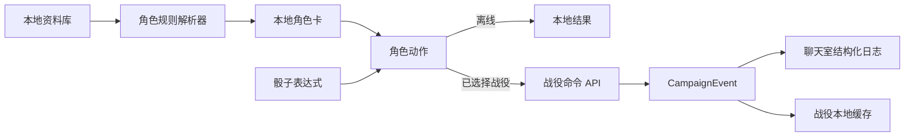

# 用户反馈整合与产品加固计划（2026-07-23）

> 本计划基于 2026-07-23 用户在 47.115.78.115 部署后的实际测试反馈，整合 [integrated-product-hardening-roadmap](../../roadmap/2026-07-23-integrated-product-hardening-roadmap.md) 中的 P0-P7 条款，明确执行顺序、依赖关系与归档范围。本计划是路线图的战术补充，不替代路线图的战略决策。

## 一、用户反馈清单（10 项）

| # | 反馈 | 现状（调研结论） | 归属阶段 |
|---|---|---|---|
| 1 | 内容库应作为只读资料查阅平台，不提供编辑条目和笔记；职业子职业查询不到；职业特性无法点击跳转；分类检索 UI 太小字挤；筛选信息不足 | UI 层实际已无编辑/笔记入口（`content_detail_page.dart:215-220` AppBar 仅收藏）；但筛选面板 chip 间距仅 6、字体偏小；facet 已覆盖 9 类但用户感受不到；子职业查询失败疑为 `structured.parentClass` 数据未填充 | P2 |
| 2 | 设置页删除快速/标准创建切换，加入更多自定义功能 | `role_mode_section.dart:64-82` "默认创建方式"为冗余项，编辑器已内置选择页 | P1 |
| 3 | 战役聊天室说/做切换应做滑块切换动画 | `chat_mode_picker.dart:9-55` 双 Expanded 按钮，仅 160ms 颜色淡入，无滑动过渡 | P0 |
| 4 | 临时角色应"用后即弃"，不保存到角色切换的临时角色栏 | 临时角色目前作为 `CampaignActor lifecycle='temporary'` 持久化在服务器，并展示在角色面板"临时角色"分区 | P7 |
| 5 | 战役中心概览元素排布混乱，成员和工具黏在一起 | `campaign_overview_panel.dart:131-173` 成员 ListTile 末尾无 Divider，紧贴 DM 工具卡（间距仅 12px） | P0 |
| 6 | 角色新建按钮与档案新建按钮风格不一致 | 角色 `FAB.extended` + 文字；档案普通 `FAB` + 仅图标 | P1（新增） |
| 7 | 战役档案标签不显示不能筛选；详情不显示正文；时间戳冗长缺编辑者 | 详情渲染逻辑存在但疑似 bug；`_TagChip` 只读无 onTap；`updatedAt` 直接拼接服务端字符串 | P6 |
| 8 | 掷骰只能丢单骰，不支持 `8d6+3` 等多骰加减值 | `campaign_chat_page.dart:489-527` 仅 7 个固定单骰按钮；引擎 `dice_roller.dart:37-49` 已支持完整表达式 | P4 |
| 9 | 角色卡检定只在内部显示，应发送到战役聊天；DM 需要快速扣血/治疗/给予装备，系统提示样式 | `character_detail_page.dart:75` `onRoll` 回调存在但三处实例化均未接线；DM 工具仅有 ±1 步进 | P5 |
| 10 | 主页战役栏把同一战役做成可展开卡片，含进入主聊/私聊/小群；清理旧接口 | `campaigns_tab_page.dart` 当前不支持展开；私聊/小群完全不存在 | P7 |

## 二、竞品参考

| 竞品 | 借鉴方向 |
|---|---|
| **D&D Beyond** | 资料库 facet 层级化筛选（level→school→class 三级 drill-down）；character builder 步骤进度条；wiki entry 编辑器字段顺序 |
| **Foundry VTT** | Dice Tray（数量/面数/修正/优劣势可视化组合；常用预设如 advantage/disadvantage 快捷按钮） |
| **Roll20** | 聊天卡片样式（检定卡：DC + 骰子结果 + 成功/失败色块；伤害卡：damage type 着色） |
| **BG3** | 战斗日志样式（HP 变化用红色/绿色色块；物品获得用系统提示样式；伤害类型分色） |
| **Owlcat CRPG** | 检定结果卡（成功绿色、失败红色、骰子明细折叠展开） |
| **Material 3 规范** | `SearchBar`+`SearchAnchor`；`FilterChip`（带 `onSelected` 与 `avatar`）；`SegmentedButton`（thumb 动画用 `AnimatedAlign`）；`FAB.extended`（统一所有新建按钮）；`NavigationBar`/`NavigationRail`；`Card`（outlined variant）；`ListTile`（three-line variant）；`Dialog`（full-screen for detail）；`BottomSheet`（standard for filter） |

## 三、统一数据流



`CampaignEvent` 最小类型集合（沿用路线图）：

- `message.say`、`message.act`、`message.narration`
- `roll.dice`、`roll.check`、`roll.save`、`roll.initiative`
- `actor.hp_changed`、`actor.item_granted`
- `archive.published`、`system.notice`

HP 与给予物品必须由服务端在同一事务中完成状态修改和事件追加。

## 四、开发顺序（Wave 1–5）

### Wave 1 — P0 + P1 高频界面与设置基础

**目标**：扫清高频路径上的视觉与可用性障碍，建立统一 Material 3 token，为后续 P2/P4/P5/P6 改造提供稳定 UI 边界。

#### Task 1.1 — 战役中心概览区块重构（P0 #4 + #5）

- 引入 section divider 系统：`_SectionHeader`（标题 + `onSurfaceVariant` 副标题 + 上下 padding 16/12）
- 成员列表区块结尾加 `Divider` + 16px 间距再接 DM 工具卡
- DM 工具卡从 `surfaceContainerHigh` 调整为 `surfaceContainerLow` + `Border`（`outlineVariant`），降低视觉权重
- 全页区块间距统一为 `{top: 16, bottom: 8}`，标题区 `{top: 24, bottom: 4}`
- **验证**：widget test 验证成员/工具/设置三区块间存在 Divider

#### Task 1.2 — 说/做切换滑块动画（P0 #2 修订）

- 保留两个 `Expanded` 的清晰语义分区（参考 Material 3 `SegmentedButton` 规范）
- 引入 thumb 滑动效果：用 `AnimatedAlign` + `Stack` 实现 240ms `Curves.easeInOutCubic` 的 thumb 过渡
- thumb 用 `secondaryContainer` 圆角矩形覆盖；切换时 thumb 滑到目标半区
- 加文字标签：「说」「做」（不再只显示 icon），符合 Material 3 `SegmentedButton` 默认行为
- **验证**：widget test 验证 thumb 位置随 mode 切换变化

#### Task 1.3 — 设置页清理与自定义增强（P1 #1 + 新增）

**删除项**：

- `role_mode_section.dart:64-82` "默认创建方式"（编辑器 `character_editor_page.dart:580-630` 已内置选择页）
- QuickBuild UI 流程 `character_editor_page.dart:1038-1139` 与 `_flowFromPreference` 中 `quick` 分支
- 同步清理 `app_preferences.dart`、`app_preferences_controller.dart:50-52`、`app_preferences_store.dart` 中对应字段
- `characters_tab_page.dart:498-500` 改为直接传 `'choose'`

**新增自定义项**（参考 D&D Beyond、Foundry）：

- 默认掷骰模式（normal/advantage/disadvantage）— 全局偏好
- 快捷骰预设（最多 6 个，长按调整顺序，可设 `2d20kh1`/`8d6`/`d20+5` 等）
- 消息密度（紧凑/标准/宽松）— 控制 chat bubble padding 与字号
- 字体缩放（系统/小/中/大）— 影响 ListTile 与 bodyMedium
- HP 警告阈值（默认 30%，控制头像生命环颜色变化）
- 角色卡默认起始 Tab（保留，有实际效果）

**验证**：widget test 验证删除项不再出现；新增项写入持久化

#### Task 1.4 — 全局 FAB 一致性（新增）

- 统一所有"新建"类入口为 `FloatingActionButton.extended` + 语义化 icon
  - 角色新建：`Icons.person_add_alt_1` + "新角色"（保留现状 `characters_tab_page.dart:116-124`）
  - 档案新建：`Icons.post_add` + "新条目"（从普通 FAB 改为 extended，`campaign_center_page.dart:118-128`）
- 统一 heroTag 规范：`fab_<domain>_<action>`，避免冲突
- 统一 onPressed 行为：直接进入创建表单，不预先弹类型选择菜单；类型选择嵌入表单首字段
- **验证**：widget test 验证两个 FAB 类型一致

### Wave 2 — P2 资料库查阅平台

**目标**：内容库明确为只读查阅平台，所有 facet 类型可检索可跳转，筛选面板达到 D&D Beyond 级别可用性。

#### Task 2.1 — 子职业/职业特性可查询性核查（P2 #2）

- 排查 `subclass.structured.parentClass` 数据是否未填充（topics.md 中 P1 issue 已记录）
- 修复 `content_repository.dart` 与 `content_library_controller.dart`：改用 `subclassOf` 稳定关系（不依赖 `structured.parentClass`）
- 职业详情页职业特性加 `trailing: chevron_right` 与 `onHover` 反馈，提升点击可见性
- **验证**：widget test 验证子职业可从职业详情跳转；facet 选项非空

#### Task 2.2 — 筛选面板 Material 3 重构（P2 #4 修订）

- 容器从 `showModalBottomSheet` 改为 `DraggableScrollableSheet`（initial 0.6, max 0.9），大屏改 `Dialog`（maxWidth 480）
- FilterChip 尺寸升级：minHeight 48, padding `symmetric(horizontal: 12, vertical: 8)`，labelStyle `labelLarge`
- Wrap spacing 从 6 改为 8，runSpacing 从 6 改为 12
- 类型 chips 改用 `ChoiceChip` 行为（单选）+ `FilterChip.menu`（facet 多选）
- facet section 标题从 `labelLarge` 改为 `titleSmall` + 加 `Icon`（spell level `Icons.auto_awesome`，school `Icons.category`，class `Icons.shield`）
- 增加 facet 计数（如「塑能 12」），来自 `content_library_controller.dart:63-85`
- **验证**：widget test 验证 chip 尺寸、间距、计数显示

#### Task 2.3 — facet 字段扩展（P2 #5）

- 扩展以下缺口：
  - **species**：新增 size、speed
  - **background**：新增 skillProficiencies
  - **condition**：新增 duration
  - **rule**：新增 category
- 修复已知数据结构缺口（topics.md 记录的 6 项）：
  - `subclass.structured.parentClass` 未填充 → 改用 `subclassOf`
  - `classFeature` 未纳入 type filter
  - `equipmentBundle` 未暴露
  - `monster` CR 排序问题
  - `feat.prerequisite` 为 free text（改为结构化）
  - `class` 类型缺 facet 字段（已加 hitDie/primaryAbility，需验证）
- **验证**：data test 验证 facet 字段填充率

### Wave 3 — P4 + P5 战役事件与角色联动

**目标**：建立 CampaignEvent 事件层，掷骰器支持完整表达式，角色卡检定直通战役聊天，DM 拥有 BG3 风格的快捷操作。

#### Task 3.1 — CampaignEvent 事件层（P4 #3 + P5 基础）

- 服务端拆分 `campaigns.service.ts` 消息/事件/会话职责
- 新增 `CampaignEvent` 类型（最小集合见第三节）
- HP 与给予物品必须在**同一事务**中完成状态修改和事件追加
- 客户端新增 `CampaignEventDispatcher`，统一发送入口
- **验证**：e2e test 验证事件原子性

#### Task 3.2 — 组合式骰子编辑器（P4 #2）

UI 布局参考 Foundry Dice Tray：

```
[骰子组1: 数量▼  d20▼  +修正▼]   [优劣势: ●普通 ○优势 ○劣势]
[骰子组2: 数量▼  d6▼   +修正▼]   [DC ▼  检定类型 ▼]
[+ 加骰子组]                      [预设: 攻击 伤害 救赎 死亡]
表达式预览: 1d20+5 + 2d6+3 = 18
[发送]
```

- 表达式预览实时更新，支持 `kh1`/`kl1`（保留最高/最低）等修饰
- 常用预设：攻击（d20+mod）、伤害（武器骰+mod）、救赎（d20+mod）、死亡救赎（d20）
- 自定义预设保存到设置（与 Task 1.3 联动）
- **验证**：widget test 验证 `8d6+3`、`2d20kh1+5` 等表达式可输入可发送

#### Task 3.3 — 角色卡 CampaignActionSink（P5 #1 + #2 + #3）

- 新增 `CampaignActionSink` 抽象，`CharacterDetailPage` 增加可选 `sink` 参数
- 三处实例化接线：
  - `campaign_chat_page.dart:855`：sink 接到 `sendMessage(kind: 'roll', eventData: {checkType, notation, total, ...})`
  - `campaign_actor_sheet_launcher.dart:170`：sink 同上，附带 `actorId`
  - `characters_tab_page.dart:572`：sink 为 null，保留 SnackBar 行为
- 角色卡内 `_RollChip` 检定 → 触发 sink → 战役聊天显示检定卡片（参考 Roll20 样式：DC + 骰子 + 成功/失败色块）
- 属性 Tab 中的豁免/技能 `_RollChip` 补齐 `diceRoller` 与 `onRoll` 参数（`character_detail_page.dart:422-453`）
- 权限：自己可编辑自己；DM 可编辑任意 Actor；其他玩家只读
- **验证**：widget test 验证角色卡检定触发 sink

#### Task 3.4 — DM 快捷操作（P5 #4 + P4 #4 系统日志样式）

DM 控场 Sheet 新增三个原子操作（参考 BG3 战斗日志）：

- **批量扣血/治疗**：选择多个 Actor + 输入数值（正数治疗/负数伤害）→ 服务端原子更新 + 广播 `actor.hp_changed` 系统事件
- **给予装备**：从资料库选物品 → 写入 Actor inventory + 广播 `actor.item_granted` 系统事件
- **快速检定**：选 Actor + 检定类型 + DC → DM 代掷 + 广播 `roll.check` 事件

系统事件聊天样式（BG3 风格）：

- HP 变化：`[Gandalf] -8 HP (52 → 44)` 红色卡片
- 治疗：`[Gandalf] +10 HP (44 → 54)` 绿色卡片
- 给予装备：`[DM] 给 [Gandalf] 长剑 ×1` 蓝色卡片
- 检定：`[Gandalf] 敏捷检定 d20+5 = 18 ≥ DC 15 ✓` 成功绿色 / 失败红色

**验证**：e2e test 验证三个操作的事务性 + 聊天广播

### Wave 4 — P6 战役档案 Wiki 化

**目标**：档案条目真正可写可搜可读，UI 达到 D&D Beyond wiki 级可用性。

#### Task 4.1 — 档案详情渲染 bug 修复

- 排查 `bodyBlocks` 序列化/反序列化问题，或 `legacyBody` 回退逻辑失效
- 验证 bodyBlocks 为空/有内容/混合三种情况的渲染
- **验证**：widget test 覆盖三种渲染分支

#### Task 4.2 — 标签筛选实现

- `_TagChip`（`campaign_archive_panel.dart:263-283`）改为 `FilterChip`，加 `onSelected` 回调
- 顶部类型 ChoiceChip 旁加标签筛选区，支持多选
- `campaign_controller.dart:328-329` `loadArchives` 增加 `tags` 参数
- 服务端 archive 查询支持 `tags` 过滤（AND/OR 可配置）
- **验证**：widget test + e2e test

#### Task 4.3 — 时间格式化与编辑者署名

- 详情页底部（`campaign_archive_panel.dart:505-511`）改为 `更新于 2026-07-23 · 由 张三`
- 用 `intl` 包 `DateFormat.yMd()` 格式化（去除时分秒）
- 服务端 schema 加 `updatedBy` 字段（记录最后修改人 userId + displayName 快照）
- 列表行元数据同步显示「由 张三 · 2026-07-23」
- **验证**：unit test 验证时间格式化

#### Task 4.4 — 创建 UI 重构

- 合并 `campaign_center_page.dart:408-526` 与 `campaign_archive_create_dialog.dart` 两套表单为单一 `CampaignArchiveEditorPage`
- 字段顺序（参考 D&D Beyond wiki entry 编辑器）：
  1. 类型（DropdownButtonFormField，4 选）
  2. 标题（必填，autofocus）
  3. 摘要（minLines 2, maxLines 3）
  4. 正文（富文本块编辑：heading/paragraph/list，每块独立卡片）
  5. 标签（Chip 输入：输入文本 + 回车添加，已加标签 FilterChip 可删除）
  6. 关联条目（多选，从战役档案其他条目搜索）
  7. 附件引用（占位，未来对接文件上传）
- 字段间距统一 `SizedBox(height: 16)`
- 提交按钮统一 `FilledButton` 全宽
- **验证**：widget test 验证字段顺序与间距

### Wave 5 — P7 会话、临时身份与战役卡片展开

**目标**：临时身份用后即弃；常驻 NPC 才是可管理的战役角色；主页战役栏支持展开进入主聊/私聊/小群。

#### Task 5.1 — 主页战役卡片可展开（P7 #1 补充）

将 `campaigns_tab_page.dart` 的 `_CampaignChatListItem`（行 672-884）改造为可展开卡片：

- **收起态**：保持现有群聊条目样式（头像 + 战役名 + 最近消息 + 时间 + 未读）
- **展开态**（点击右侧 chevron 展开，或长按卡片）：
  - 战役简介（description，最多 2 行）
  - 成员头像叠放 + 总数
  - 未读消息数汇总
  - **置顶主聊天室入口**（主按钮，点击直接进入 `CampaignChatPage`，行为同当前 onTap）
  - **私聊列表入口**（如有，显示数量徽章；点击进入私聊列表）
  - **小群列表入口**（如有，显示数量徽章；点击进入小群列表）
  - **创建私聊/小群入口**（DM 可见，普通成员可创建私聊）
- 展开动画用 `AnimatedSize` + `Curves.easeInOutCubic` 240ms
- 同一时间只允许一个卡片展开（single open accordion）
- **验证**：widget test 验证展开/收起、单一展开态、各入口点击行为

#### Task 5.2 — 临时身份用后即弃（P7 #2）

- 重构 `campaign_chat_page.dart:1058-1062` `_TemporaryIdentityDraft`：
  - 草稿保留在内存（现状）
  - **不再调用服务端创建 `CampaignActor`**，而是把 displayName 作为 speaker snapshot 写入消息
- 服务端 `sendMessage` 接受可选 `speakerSnapshot: {displayName, avatarUrl?}`，不再创建临时 Actors
- 角色面板 `campaign_characters_panel.dart:59` 删除"临时角色"分区
- 历史消息回读时直接展示 snapshot 中的 displayName
- 同步清理 `campaign_actor_controller.dart:334-357` `createTemporaryNpc` 与服务端 `sendDraftActorMessage`（`campaigns.service.ts:617-709`）
- **验证**：e2e test 验证临时身份不创建 Actor；消息发送后草稿清空

#### Task 5.3 — 主聊/私聊/小群（P7 #1 + #4）

- 一个战役拥有置顶主聊天室，并可创建私聊和小群
- 私聊仅参与者可见，战役 owner 不自动获得读取权限
- 同一战役卡片可展开进入主聊、私聊和小群（与 Task 5.1 联动）
- 服务端新增 `Conversation` 模型（campaignId / type: main/direct/group / participantIds）
- 客户端新增 `ConversationController` 管理多会话切换
- **验证**：e2e test 验证可见性

## 五、旧接口清理清单

### 5.1 已完成归档（本轮已执行）

- ✅ 6 个 git worktree 全部删除（campaign-center, character-experience, content-library, content-wiki, offline-first-plans, settings-theme）
- ✅ 6 个已合并本地分支全部删除
- ✅ campaign-center worktree 最后一个文档修复 commit（043f7a5）已 cherry-pick 到主分支 archive 版本（commit 90ce611）
- ✅ 所有 plans 已归档到 `docs/superpowers/plans/archive/`，活动 plans 目录为空

### 5.2 待清理的旧接口（按 Wave 推进）

| 项 | 位置 | 清理时机 | 处理方式 |
|---|---|---|---|
| `HomeDashboardPage` | `apps/client_flutter/lib/src/features/server_home/presentation/home_dashboard_page.dart` | Wave 1 | 删除文件（全项目零引用死代码） |
| `CampaignListTile` widget | `apps/client_flutter/lib/src/features/campaigns/presentation/widgets/campaign_list_tile.dart` | Wave 5（与 Task 5.1 重构同步） | 删除文件或合并到 `_CampaignChatListItem` |
| `LegacyCharacterImporter` | `apps/client_flutter/lib/src/features/characters/data/legacy_character_importer.dart:6-33` | Wave 1 | 确认无引用后删除（疑似死代码） |
| 过时注释"与 sessions 模块保持一致" | `apps/server_nest/src/modules/campaigns/campaigns.service.ts:1010` | Wave 1 | 清理注释 |
| `GET :id/check-requests` 端点 | `apps/server_nest/src/modules/campaigns/campaigns.controller.ts:97-103` + `campaigns.service.ts:319` | Wave 3 | 复查客户端是否仍调用，否则下线（检定历史已收敛为 CampaignChatMessage 聚合） |
| `CharacterCampaignBinding` 全套 | 服务端 `characters.service.ts:121-168,193-205,230-...` + 客户端 `character_api_client.dart:57,64,211,227,233,249` + Prisma `schema.prisma:517` | Wave 3（CampaignActor 体系完全接管后） | 删除表与端点，迁移存量数据到 CampaignActor |
| 临时角色持久化路径 | 服务端 `sendDraftActorMessage`（`campaigns.service.ts:617-709`）+ 客户端 `createTemporaryNpc`（`campaign_actor_controller.dart:334-357`） | Wave 5（Task 5.2） | 改为 speaker snapshot，不落库 |
| Prisma 残留 Session/CheckRequest 表 | `apps/server_nest/prisma/schema.prisma` | Wave 3 后 | 择机清除，需先确认无预发布数据迁移需求 |
| `_showQuickTemporaryForm` | `characters_tab_page.dart:420-479` | Wave 5（Task 5.2） | 与临时角色持久化路径同步删除 |
| 临时角色面板分区 | `campaign_characters_panel.dart:59,173,189-190,205,470` | Wave 5（Task 5.2） | 删除"临时角色"分区 |

### 5.3 非清理项（明确保留）

以下虽含 `legacy` 字样但属兼容性工具或正常业务字段，**不清理**：

- `LegacyClassFeatureRulesMigrator`（`content/data/import/legacy_class_feature_rules_migrator.dart`）— 内容包旧格式迁移器
- `_LegacyFormatBanner`（`content_import_preview_dialog.dart:80`）— 导入期兼容提示
- `legacyBody`（archive 正文回退字段）— P6 Wiki 化前的兼容字段，待 Wave 4 重构后视情况清理

## 六、并行编排与依赖关系

```
Wave 1 (P0+P1) ──┬─> Wave 2 (P2) ──┐
                 │                  │
                 └─> Wave 3 (P4+P5)─┴─> Wave 4 (P6) ──> Wave 5 (P7)
                   [依赖 CampaignEvent]
```

### 串行/并行关系

1. **Wave 1 先做**：高频界面与设置基础是后续所有 UI 改造的边界，必须先稳。Wave 1 内 4 个任务可并行（不互相依赖，且不修改同一文件族）。

2. **Wave 2 与 Wave 3.1+3.2 可并行**：
   - Wave 2 改资料库（`content/`）
   - Wave 3.1 改服务端 `campaigns.service.ts` 与客户端 `campaigns/domain/`
   - Wave 3.2 改 `core/dice/` + chat composer
   - 三者文件不重叠，可并行开发

3. **Wave 3.3 + 3.4 必须在 Wave 3.1 之后**：CampaignEvent 是角色卡 sink 和 DM 操作的依赖。

4. **Wave 4 在 Wave 3 之后**：档案 wiki 化的「时间格式化与编辑者署名」需要 `CampaignActorAudit` 与 `CampaignEvent` 已稳定；标签筛选也需要服务端查询能力（不依赖 CampaignEvent，但依赖 `campaigns.service.ts` 拆分）。

5. **Wave 5 最后做**：临时身份重构涉及消息发送链路改造，需 CampaignEvent 已稳定；战役卡片展开依赖私聊/小群会话模型；主聊/私聊/小群是 P7 末尾工作。

## 七、第一周建议起点

按用户反馈强度与「最快见效」原则，建议**第一周完成 Wave 1**：

| 顺序 | 任务 | 原因 |
|---|---|---|
| 1 | Task 1.1 战役中心区块重构 | 用户反馈"黏在一起"，纯 UI 改动，最快见效 |
| 2 | Task 1.2 说/做滑块动画 | 高频路径，视觉提升明显 |
| 3 | Task 1.4 全局 FAB 一致性 | 一致性问题已暴露，改动小 |
| 4 | Task 1.3 设置页清理与自定义增强 | 删除冗余 + 增加自定义项，需更多设计决策 |

## 八、验证策略

- 每个行为先写 Widget 测试并确认失败，再实现（TDD）
- Wave 1 运行相关 Widget 测试、`flutter analyze` 和 Web release build
- Wave 2-Wave 3 数据协议阶段增加 Nest 单元/e2e 测试、Flutter 仓储测试及离线回归测试
- Wave 4-Wave 5 涉及消息发送链路改造，必须运行服务端 e2e + 客户端 widget test
- 版本封板时再运行仓库级 `npm run doctor`

## 九、归档记录（2026-07-23）

### 9.1 Worktree 归档

本轮归档前存在 6 个 git worktree，状态如下：

| Worktree | 分支 | 合并状态 | 处理 |
|---|---|---|---|
| `.worktrees/campaign-center` | `feat/v0.1-campaign-center` | squash merge 已入 offline-first-0.1（`12a6f67`），仅剩 1 个文档修复 commit `043f7a5` 未合并 | 文档修复已 cherry-pick 为 `90ce611`，worktree 已删除 |
| `.worktrees/character-experience` | `feat/v0.1-character-experience` | 已合并（`040873b`） | worktree 已删除，分支已删除 |
| `.worktrees/content-library` | `feat/v0.1-content-library` | 已合并（`ef2e89f`） | worktree 已删除，分支已删除 |
| `.worktrees/content-wiki` | `feature/0.1-content-wiki` | 已合并 | worktree 已删除，分支已删除 |
| `.worktrees/offline-first-plans` | `plans/offline-first-compendium` | 已合并 | worktree 已删除，分支已删除 |
| `.worktrees/settings-theme` | `feat/v0.1-settings-theme` | 已合并（`a89f1c6`） | worktree 已删除，分支已删除 |

### 9.2 Plans 归档

所有 plans 已归档到 `docs/superpowers/plans/archive/`，活动 plans 目录为空。本计划文档是新一轮计划的起点。

### 9.3 当前分支状态

- 主工作区：`offline-first-0.1`（HEAD `90ce611`）
- 剩余分支：`main`、`offline-first-0.1`
- 无残留 worktree

## 十、与现有路线图的关系

本计划是 [integrated-product-hardening-roadmap](../../roadmap/2026-07-23-integrated-product-hardening-roadmap.md) 的战术补充：

- **沿用**：P0-P7 阶段划分、统一数据流、CampaignEvent 类型集合、产品原则
- **修订**：P0 #2「说/做切换」从"避免滑块"修订为"保留两按钮语义 + 加入 thumb 滑动动画"
- **新增**：P1 加入"全局 FAB 一致性"任务（Task 1.4）
- **细化**：P2 细化为 3 个子任务（核查、UI 重构、字段扩展）
- **细化**：P6 细化为 4 个子任务（bug 修复、标签筛选、时间格式化、UI 重构）
- **补充**：P7 加入"主页战役卡片可展开"任务（Task 5.1）
- **明确**：旧接口清理清单与清理时机（第五节）

若本计划与路线图冲突，路线图优先；本计划负责落地执行。
